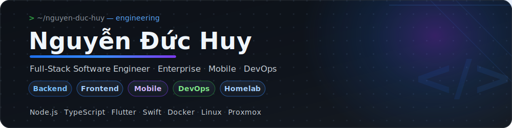
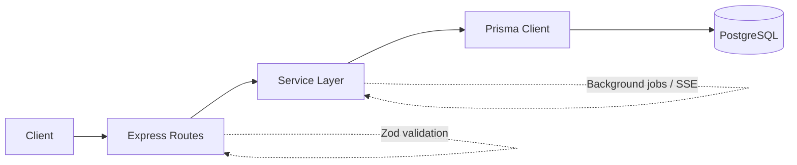
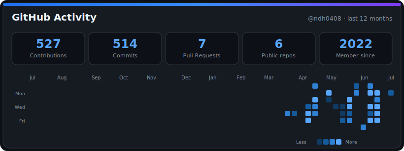
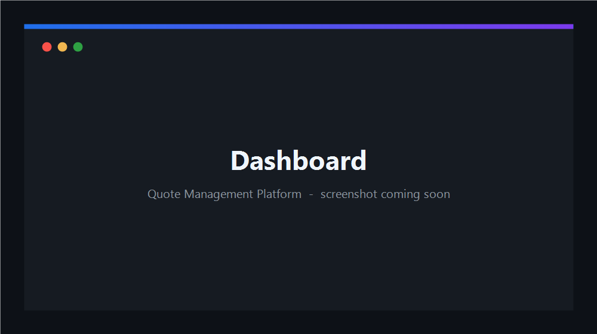
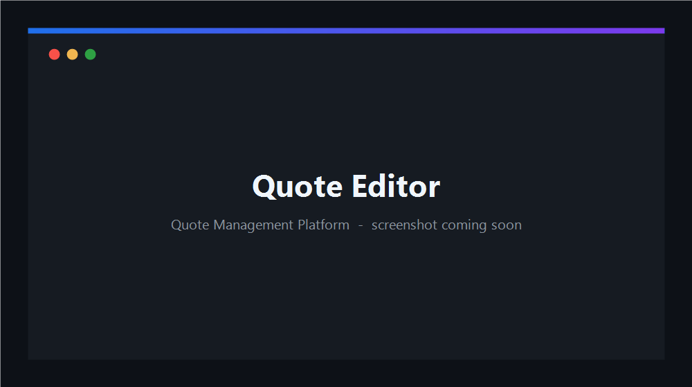
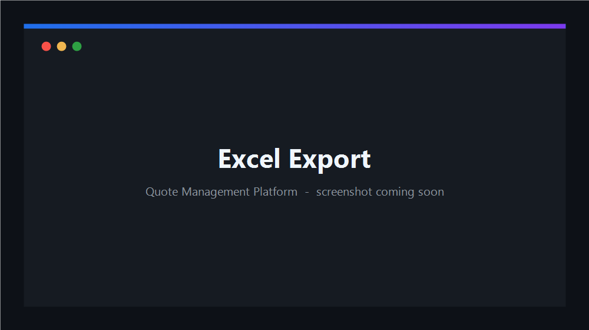

  

  <em>Backend architecture, self-hosted infrastructure, and cross-platform mobile — built to run in production.</em>

  
  
  

 

## 👨‍💻 About Me

Full-Stack Software Engineer building enterprise applications, self-hosted infrastructure, and cross-platform mobile experiences. I design backends for long-lived production systems, not demos — the software I ship serves real users and is maintained over time.

I use modern AI tooling to accelerate code reviews, refactoring, documentation, and architecture exploration — while remaining responsible for every implementation and technical decision. I care about **documentation**, and I usually start from the business problem itself: mapping real-world processes — quotations, approval flows, permissions — into maintainable systems. I consistently prefer production-ready, usable software over throwaway prototypes.

_Outside of work, I enjoy building homelab infrastructure, running community gaming servers, experimenting with Apple ecosystems through Hackintosh, and finding ways to make software more reliable and enjoyable to use._

> **Interested in:** secure-by-default backend systems • RBAC & auditability • enterprise software • self-hosted infrastructure • production operations

<table>
  <tr>
    <th align="left">Domains</th><th></th>
    <th align="left">Technologies</th><th></th>
  </tr>
  <tr><td><b>Backend Engineering</b></td><td>★★★★★</td><td><b>TypeScript / Node.js</b></td><td>★★★★★</td></tr>
  <tr><td><b>Enterprise Software</b></td><td>★★★★★</td><td><b>PostgreSQL / Prisma</b></td><td>★★★★☆</td></tr>
  <tr><td><b>System Design / Architecture</b></td><td>★★★☆☆</td><td><b>Docker / Linux</b></td><td>★★★★☆</td></tr>
  <tr><td><b>DevOps &amp; Self-hosting</b></td><td>★★★★☆</td><td><b>Flutter / Dart</b></td><td>★★★★☆</td></tr>
  <tr><td><b>Full-Stack</b></td><td>★★★★☆</td><td><b>React / Vite</b></td><td>★★★☆☆</td></tr>
</table>

## 🚀 What I'm Building

- **Quotation & approval platform** — an enterprise system for building, versioning, and approving quotes, used daily by a real business.
- **Phố Game Chill** — a cross-play (PC + Mobile) Minecraft community server for the ~1,500-member gaming community I founded and run.
- **Native iOS app** — built with **Swift / SwiftUI**, including a full self-configured build-and-deploy pipeline.
- **Self-hosted homelab** — a multi-node **Proxmox + Docker + Coolify + Cloudflare Tunnel** stack running my services end to end.

## 🛠️ Tech Stack

**Languages**

**Backend**

**Databases**

**Frontend**

**Mobile**

**DevOps & Infrastructure**

## 🏗️ Architecture Expertise

I structure backends as a **layered, modular architecture** and apply **Clean Architecture principles** where they earn their keep: HTTP concerns stay at the route layer, business rules live in services, and data access goes through Prisma. This keeps enterprise logic — **multi-stage approval workflows**, **RBAC / role-permission** models, and the full **quotation lifecycle** (draft → version → review → approve/reject) — testable and independent of transport and storage.

A rarer, high-value specialty I've built out is **dynamic Excel automation via raw OOXML** — stitching multiple spreadsheet templates together at the XML level to produce complex, brand-accurate exports that off-the-shelf libraries can't express. Combined with server-side PDF generation, this powers the document engine at the heart of the quotation platform.

## 📈 GitHub Activity

  

## 🏆 Featured Projects

<table>
  <tr>
    <td>

### Quotation & Approval Platform

Production-grade quotation & approval system built as a layered **Express + TypeScript** API on **Prisma 7 / PostgreSQL 16**, with a React 19 frontend progressively replacing a legacy SPA. Shipped and maintained in production for a paying business.

**Highlights**

- ✔ Authentication (JWT + refresh tokens, TOTP 2FA)
- ✔ Role Management / RBAC (granular role-permission model + per-user overrides)
- ✔ Dynamic Excel export via **OOXML** template stitching
- ✔ PDF generation with embedded fonts
- ✔ Multi-stage Approval Workflow with full audit trail
- ✔ PostgreSQL with a versioned, multi-sheet quote model
- ✔ Dockerized (staging / prod compose, background job workers)
- ✔ Responsive UI

**Tech:** TypeScript · Express · Prisma · PostgreSQL · Redis · BullMQ · React 19 + Vite · Docker

 

  </td>
  </tr>
</table>

<table>
  <tr>
    <td width="50%" valign="top">

#### Phố Game Chill — Minecraft Server

Cross-play (PC + Mobile) survival & community server for a ~1,500-member community I founded and run. Java + Bedrock crossplay, full plugin stack, automated backups/restarts, and DDoS mitigation.

`Java` · `Docker` · `Linux`

  </td>
  <td width="50%" valign="top">

#### Cross-Platform Mobile App

A Flutter application that delivers a native-feeling UX across iOS and Android from a single codebase.

`Flutter` · `Dart`

  </td>
  </tr>
</table>

**Side projects & tinkering** — Hackintosh on a Lenovo Legion Y9000P (OpenCore configuration, ACPI patching, and hardware bring-up notes).

<!--
## 📷 Screenshots
Re-enable once real, high-resolution captures are committed at these exact paths on the
default branch: ./assets/quanly-dashboard.png, ./assets/quanly-quote.png, ./assets/quanly-export.png

  
  
  
   
  Quote Management Platform — dashboard, quotation editor, and document export.

-->

## 🎯 2026 Roadmap

- [x] Native iOS app (Swift/SwiftUI)
- [x] Dockerize all self-hosted services
- [ ] CI/CD pipelines (GitHub Actions)
- [ ] Kubernetes
- [ ] Microservices architecture
- [ ] Deeper AI integration

## 🤝 Contact

  
  
  

